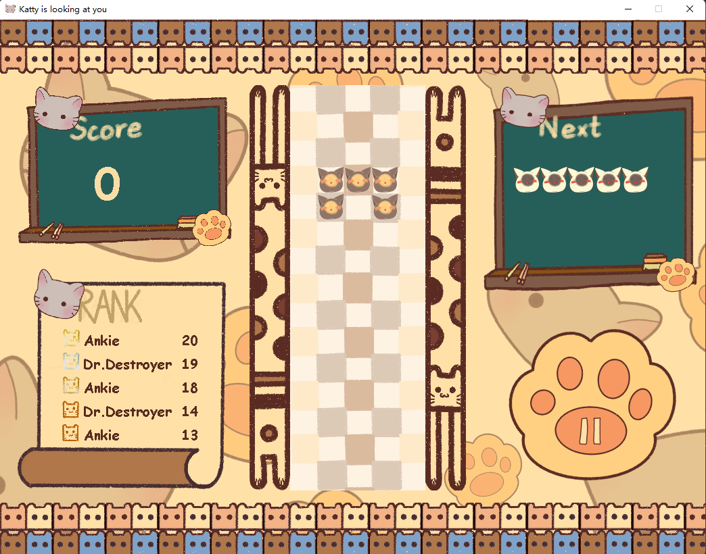
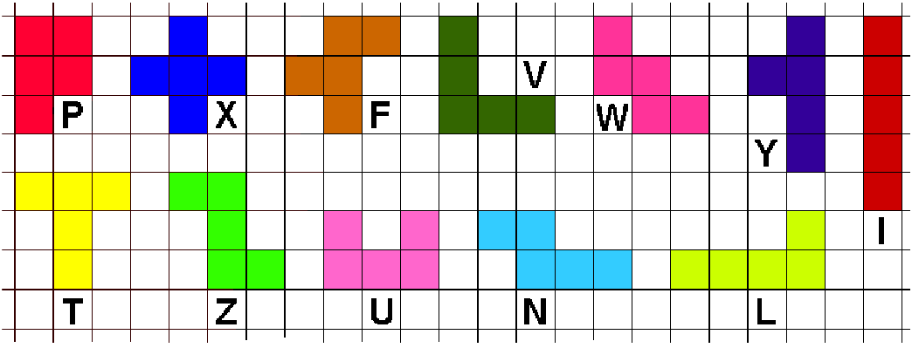

# Pentomino Tetris Game with a Bot
Project 1-1, Maastricht University. Oct 2021 – Jan 2022.

In this project, a program has to be implemented that fills up a given rectangle with given objects
(pentominoes). In the second phase, a Tetris game is implemented in which the falling objects are pentominoes. In the
last phase, an algorithm has to be designed to solve three dimensional knapsack problems.  

## Running the code:
Requirement: JDK 11+  

### Pentomino Tetris Game:
Run the entry [`Main.java`](/Pentomino/src/pentomino/tetris/game/game/Main.java)  

#### Player instruction(in player mode game): 
+ Press `←` or `→` to move the piece 
+ Press `↑` to rotate the piece
+ Press `↓` to speed falling up

### 2D solver:
+ Run the entry [`Search.java`](/Pentomino/src/2DSolver/Search.java)  
+ DLX for pentomino filling: [`DancingLink.java`](/Pentomino/src/2DSolver/DancingLink.java)
+ DLX for Knapsack problem: [`DancingLinksX.java`](/Pentomino/src/KnapsackProb/DancingLinksX.java)  

## Announcement
+ Game UI designed by **Jiaru Zheng**(<a href="mailto:jiaru.zheng@student.uva.nl">jiaru.zheng@student.uva.nl</a>). **Do not use any of the images in [Pentomino/Graphics](/Pentomino/Graphics/) for any purpose without permission.**  

+ Please note that references to this code may be considered **academic plagiarism** (for UM students).

+ All the code in this repository was done independently by myself.  

## Introduction
Pentominoes are the planar structures that can be obtained by attaching 5 squares of size 1x1 to each other. There are precisely 12 pentominoes and the following picture shows a representation of these.

As is clear from the picture, the pentominoes can be identified by characters in a natural way.

### Pentomino Tetris Game
This is a computer application with a user-friendly interface to play the game of Tetris using the 12 pentomino-shapes that appear for the player in random order, each with the same probability. For the structure of the field, this game uses a board of width 5 and height 15. In player mode, players can play, speed falling up, pause, preview the next piece, save their score in Rank when finishing.  In bot mode, an AI bot will play this game with visible process.

### Pentominoes Filling Solver:
It's an algorithm to find out if a given set of pentominoes completely covers a rectangle of a given size. There are 2 implementations in [2Dsolver](/Pentomino/src/2DSolver/). [Search](/Pentomino/src/2DSolver/Search.java) provided a solver based on depth-first search. 

#### Dancing Link
Dancing Link X algorithm(DLX) is implemented manually for a 3D [Knapsack problem](/Pentomino/src/KnapsackProb/): you have different types of parcels, each with its own set of dimensions (length, width, and height) and values. You also have a truck with its own dimensions. The objective is to determine the optimal way to pack the parcels into the truck to maximize the total value while staying within the truck's size constraints. This algorithm can find the **optimal solution** to this problem faster, but the calculation speed is still much higher than the greedy algorithm.  
This algorithm can also be applied to pentominoes filling problems, so its use cases can also be seen in 2DSolver. It performs much better when rectangle is special or extremely big.  

## Methodology

### Pentomino Tetris Game Bot
+ Pierre Dellacherie Algorithm: Calculate a score out for every possible placement, where score is weighted average of a series of features' scores.  
  
  
+ Particle Swarm Optimization (PSO): Find the best weights $w_n$ for weighting the average of scores.

### Dancing Link X
+ Dancing links X is an algorithm to solve the complete coverage problem.
+ Dancing Links data structure: a cross circular doubly linked list.

